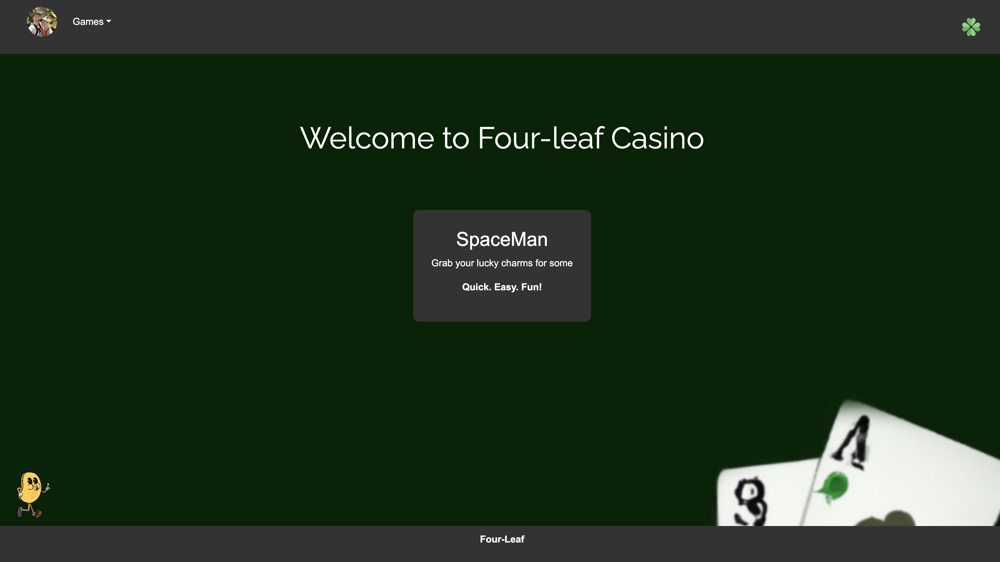

# Four-leaf Casino 

  

  ## Description

  Four-leaf Casino is a fun and interactive game for users to play. The game is a simple game of chance. The user will be given a starting amount to play with and can add funds. Currently players can access Blackjack.

  ## Table of Contents

  - [Installation](#installation)
  - [Usage](#usage)
  - [Images](#images)
  - [Credits](#credits)
  - [License](#license)
  - [Tests](#tests)
  - [Questions](#questions)

  ## Installation

    N/A

  ## Usage

  After registering and logging in, the user will be able to play Blackjack and future games!
  
  ## Images
  
    
    
    
  

  ## License

 This project is licensed under the MIT license. To learn more please visit https://choosealicense.com/licenses/mit/

  ## Contributing

  Sam Jones,
  Al,
  Jonathan,
  Jose 

  ## Tests

  N/A

  ## Questions

  If you have any questions about the repo, open an issue or contact me directly at [samejones2018@gmail.com](mailto:samejones2018@gmail.com). You can find more of my work at [ParticularSpace](https://github.com/ParticularSpace).

