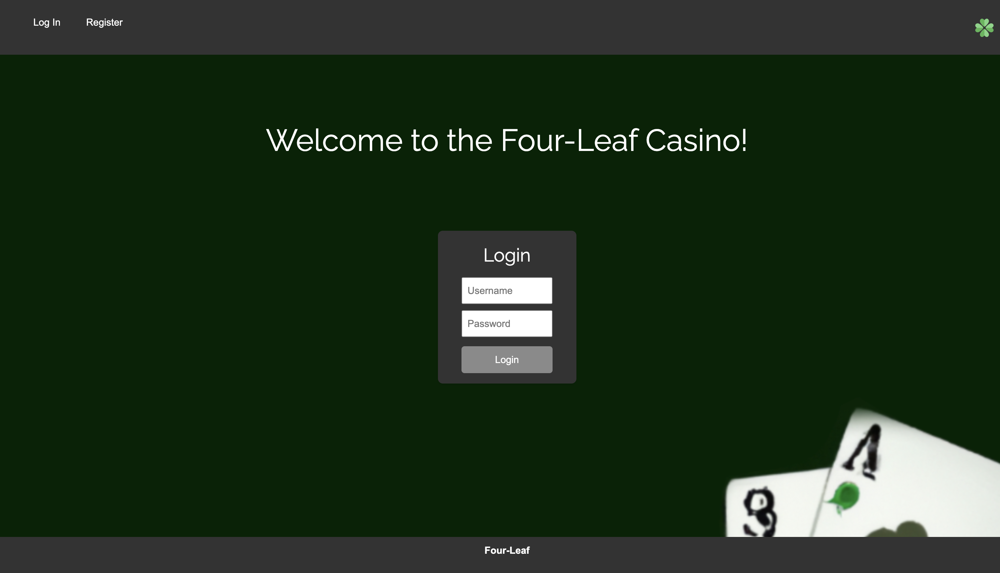
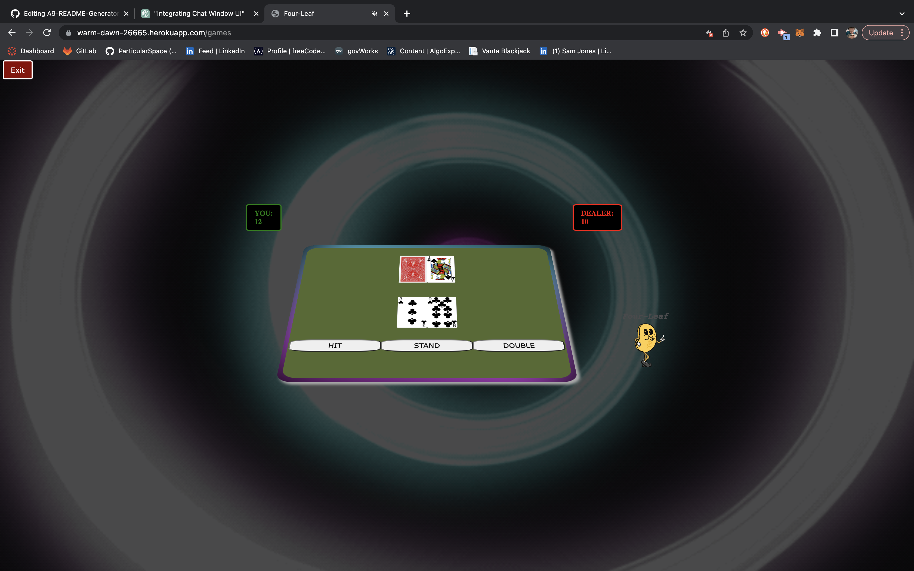

# Four-leaf Casino 

  
  
  ## URL
  
https://warm-dawn-26665.herokuapp.com/login

  ## Description

  Four-leaf Casino is a fun and interactive game for users to play. The game is a simple game of chance. The user will be given a starting amount to play with and can add funds. Currently players can access Blackjack.

  ## Table of Contents

  - [Installation](#installation)
  - [Usage](#usage)
  - [Images](#images)
  - [Credits](#credits)
  - [License](#license)
  - [Tests](#tests)
  - [Questions](#questions)

  ## Installation

  N/A

  ## Usage

  After registering and logging in, the user will be able to play Blackjack and future games!
  
  ## Images
  
  
  
  
  
  ## License

 This project is licensed under the MIT license. To learn more please visit https://choosealicense.com/licenses/mit/

  ## Credits

  Sam Jones,
  Al,
  Jonathan,
  Jose 

  ## Tests

  N/A

  ## Questions

  If you have any questions about the repo, open an issue or contact me directly at [samejones2018@gmail.com](mailto:samejones2018@gmail.com). You can find more of my work at [ParticularSpace](https://github.com/ParticularSpace).

Define the Game State: You need to define what your game state will look like. This will likely include the players' hands, the dealer's hand, the current turn, and any other information that's relevant to a game of blackjack.

Handle Client Actions: Modify your client-side code to send a message over the WebSocket connection whenever a player takes an action. This message should include the action taken (like 'hit', 'stay', 'bet', etc.) and any associated data (like the bet amount).

Update Game State: On the server, listen for these action messages from the clients. When you receive an action, update the game state accordingly.

Broadcast Game State: After updating the game state, serialize it into a format that can be sent over the WebSocket connection (like JSON), and broadcast it to all connected clients.

Handle Server Updates: On the client, listen for these game state messages from the server. When you receive a game state message, update the local game state to match and re-render the game interface as necessary.

Handle Multiple Tables: Implement a system for handling multiple tables. This could involve creating a "Room" class that contains its own game state and list of connected clients. When a client connects, they would specify which room they want to join, and the server would add them to that room.